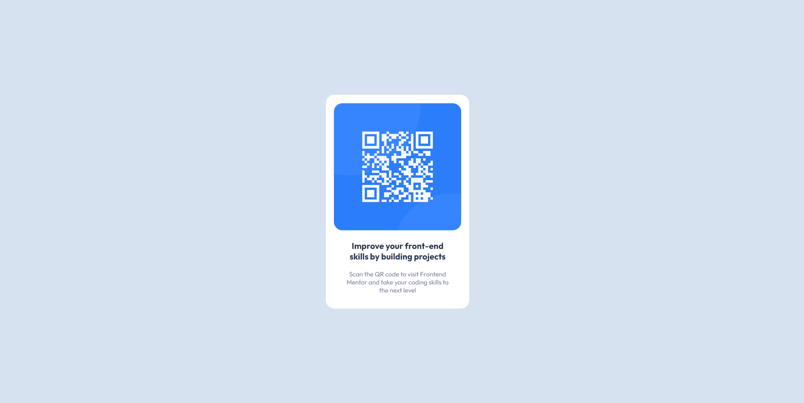

### Screenshot

### Built with

- Semantic HTML5 markup
- CSS custom properties
- SASS
- Flexbox
- CSS Grid
- Mobile-first workflow

### What I learned

### Useful resources

- [SASS](https://sass-lang.com/documentatio) - SASS is a great tool for keeping my CSS organized.
- [Frontend Mentor](https://www.frontendmentor.io/) - This work the very first challenge from Frontend Mentor and it's completely free!

## Author

- Frontend Mentor - [@ofins](https://www.frontendmentor.io/profile/ofins)

