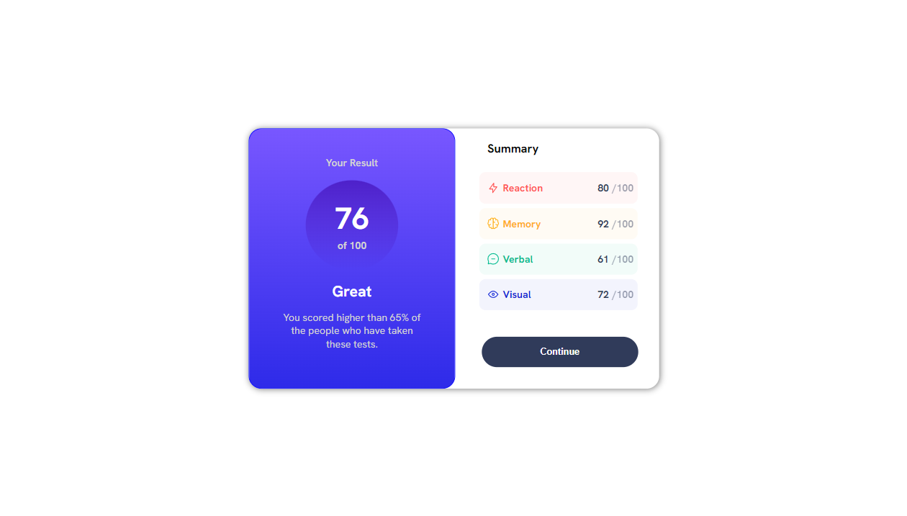
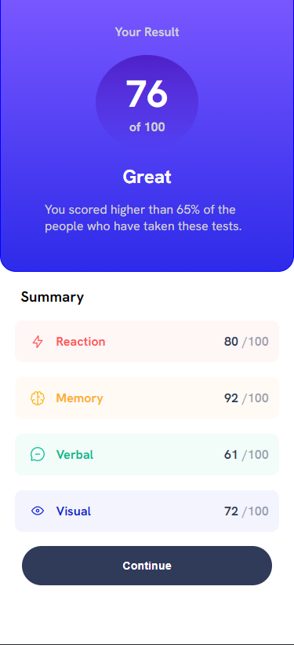

### The challenge

[Website-hosted with Netlify](https://resultsummarycomponentchallenge.netlify.app/)

Users should be able to:

- View the optimal layout for the interface depending on their device's screen size
- See hover and focus states for all interactive elements on the page

### Screenshot




## My process

### Built with

- HTML5
- SASS

### What I learned

To use the data provided dynamically, I use the map method.

```js
const listElements = data.map(item => (
      `<div class="listbox ${item.category}">
        <span class="listbox--A">
          
          <span class="listbox--category">${item.category}</span>
          </span>
          <p class="listbox--score">${item.score}<span>/100</span></p>
        </div>
      `
    ))
```

## Author

- Frontend Mentor - [@ofins](https://www.frontendmentor.io/profile/ofins)

## Acknowledgments
